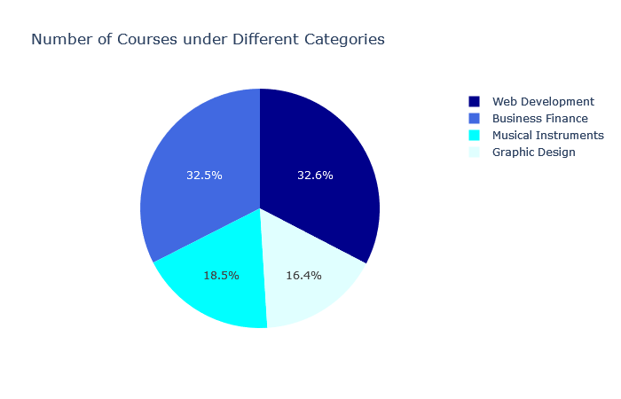
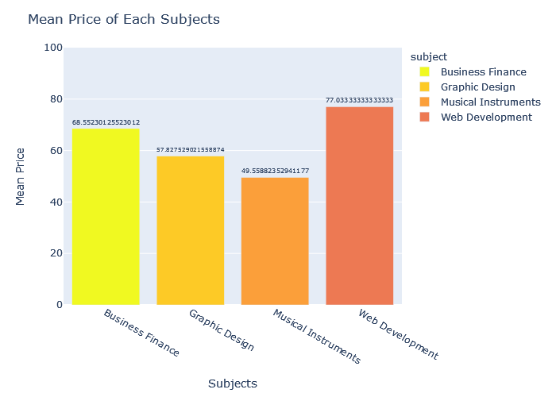

# Creating a Machine Learning-Based for check The Mental Health

---


---

## Author: Juan Carlos González
## E-mail: jcgi.laboral@gmail.com

---

## Date: December, 2022

---

---

# Project Objective
The 2014 Mental Health in Tech Survey aimed to understand the prevalence of mental health issues within the tech industry and assess how companies in this sector are addressing these concerns. The survey was designed to raise awareness, identify gaps in support systems, and encourage better mental health practices within an industry known for high stress and burnout.

# Key Problematic Areas:

- Stigma Around Mental Health:

    - Perception of Mental Health: In 2014, mental health issues in the workplace, particularly in tech, were often seen as a sign of weakness. This stigma could prevent employees from seeking help or disclosing mental health conditions due to fear of being judged or discriminated against.
    - Impact on Career: Employees were concerned that acknowledging mental health struggles could negatively impact their career progression, lead to fewer opportunities, or even result in job loss.

- Lack of Awareness and Education:

    - Limited Mental Health Policies: Many companies, especially tech startups and small to medium-sized businesses, lacked formal mental health policies. Employees often did not know what resources were available or how to access mental health support.
    - Untrained Management: Many managers and HR departments were not equipped with the necessary training to recognize or support employees facing mental health challenges. This lack of awareness could exacerbate stress and workplace dissatisfaction.

- Workplace Culture:

    - High-Pressure Environment: The tech industry is known for its long hours, tight deadlines, and high expectations, often contributing to stress, anxiety, and burnout. The survey aimed to measure the impact of this environment on mental health.
    - Remote Work and Isolation: Many tech employees work remotely or have flexible hours, which, while convenient, can lead to isolation and a lack of social support from colleagues.

- Access to Mental Health Resources:

    - Unequal Access: While some large tech companies provided mental health benefits such as therapy or counseling, smaller companies and startups often didn’t have the resources to offer comprehensive mental health support.
    - Cost and Insurance Barriers: Even when mental health resources were available, employees could face significant barriers, such as high costs or lack of coverage in health insurance plans.

# Table of Contents
1. Data Introduction
2. Data Cleaning
   2.1 Null Values
      - 2.1.1 Comments
      - 2.1.2 States
      - 2.1.3 Work Interfere
      - 2.1.4 Self Employed
   2.2 Data Consistency
      - 2.2.1 Gender
      - 2.2.2 Age
3. Data Analysis & Visualizations
   - 3.1 Age
   - 3.2 Gender
   - 3.3 Country
   - 3.4 Work Interference with Mental Health based on Gender
   - 3.5 Work Interference with Mental Health based on the Company Type (Tech/Non-Tech)
   - 3.6 Remote Work Environment and Work Interference
   - 3.7 Mental Health Benefits
   - 3.8 Mental Health vs. Physical Health
     - 3.8.1 Do you think that discussing a health issue with your employer would have negative consequences?
     - 3.8.2 Have you heard of or observed negative consequences with mental health conditions in your workplace?
   - 3.9 Mental/Physical Health Issues in Interviews
     - 3.9.1 Would you bring up a mental/physical health issue with a potential employer in an interview?
   - 3.10 Willingness to Discuss a Mental Health Issue
   - 3.11 Word Cloud on Comments
4. Machine Learning
   - Cleaning
   - Encoding
   - Scaling & Fitting
   - Logistic Regression
   - K-Neighbors Classifier
   - Decision Tree Classifier
   - Random Forest
   - Accuracy Scores
5. Conclusion

```python
import pandas as pd
import numpy as np
import plotly.express as px
import plotly.graph_objects as go
from plotly.subplots import make_subplots
from wordcloud import WordCloud, STOPWORDS, ImageColorGenerator
from collections import Counter
import matplotlib.pyplot as plt
import re
import seaborn as sns
from sklearn.model_selection import train_test_split
from sklearn import preprocessing
from sklearn.preprocessing import LabelEncoder, MinMaxScaler
from sklearn.linear_model import LogisticRegression
from sklearn.tree import DecisionTreeClassifier
from sklearn.ensemble import RandomForestClassifier, ExtraTreesClassifier
from sklearn.neighbors import KNeighborsClassifier
from sklearn import metrics
from sklearn.metrics import accuracy_score
from sklearn.model_selection import cross_val_score

# Display all columns
pd.set_option('display.max_columns', None)

# Load the dataset
survey = pd.read_csv('survey.csv')


## 1. Data Cleaning

```python
import pandas as pd
import numpy as np
pd.set_option('display.max_columns', None)
pd.set_option('display.max_rows', 100)
import plotly.express as px
import plotly.graph_objects as go
import matplotlib.pyplot as plt
from collections import Counter
from wordcloud import WordCloud, STOPWORDS, ImageColorGenerator

```
## Data Descriptions

| Column Name            | Description                                                                       |
|------------------------|-----------------------------------------------------------------------------------|
| family_history          | Do you have a family history of mental illness?                                   |
| treatment               | Have you sought treatment for a mental health condition?                          |
| work_interfere          | If you have a mental health condition, do you feel that it interferes with work?  |
| no_employees            | How many employees does your company or organization have?                        |
| remote_work             | Do you work remotely (outside of an office) at least 50% of the time?             |
| tech_company            | Is your employer primarily a tech company/organization?                           |
| benefits                | Does your employer provide mental health benefits?                                |
| care_options            | Do you know the mental health care options provided by your employer?             |
| wellness_program        | Has your employer ever discussed mental health as part of a wellness program?     |
| seek_help               | Does your employer provide resources to learn about mental health and seek help?  |
| anonymity               | Is your anonymity protected if you use mental health or substance abuse resources?|
| leave                   | How easy is it to take medical leave for a mental health condition?               |
| mentalhealthconsequence | Do you think discussing a mental health issue with your employer would have consequences? |
| physhealthconsequence   | Do you think discussing a physical health issue with your employer would have consequences? |
| coworkers               | Would you discuss a mental health issue with your coworkers?                      |
| supervisor              | Would you discuss a mental health issue with your supervisor(s)?                  |
| mentalhealthinterview   | Would you bring up a mental health issue with a potential employer in an interview?|
| physhealthinterview     | Would you bring up a physical health issue with a potential employer in an interview?|
| mentalvsphysical        | Do you feel your employer takes mental health as seriously as physical health?    |
| obs_consequence         | Have you observed negative consequences for coworkers with mental health issues?  |
| comments                | Any additional notes or comments                                                  |


```python
survey.shape
```

```bash

(1259, 27)
```

```python
survey.columns

```



```python
survey.describe()
```


```python
survey.isna().sum()
```


```python
percent_missing = survey.isnull().sum() * 100 / len(survey)
null_percentage = pd.DataFrame({'Column Name': survey.columns,
                                 'Missing Percentage': percent_missing})

null_percentage.sort_values('Missing Percentage', ascending=False, inplace=True)
null_percentage

```

| Column Name               | Missing Percentage  |
|---------------------------|--------------------:|
| comments                  | 86.973789           |
| state                     | 40.905481           |
| work_interfere            | 20.969023           |
| self_employed             | 1.429706            |
| seek_help                 | 0.000000            |
| obs_consequence           | 0.000000            |
| mental_vs_physical        | 0.000000            |
| phys_health_interview     | 0.000000            |
| mental_health_interview   | 0.000000            |
| supervisor                | 0.000000            |
| coworkers                 | 0.000000            |
| phys_health_consequence   | 0.000000            |
| mental_health_consequence | 0.000000            |
| leave                     | 0.000000            |
| anonymity                 | 0.000000            |
| Timestamp                 | 0.000000            |
| wellness_program          | 0.000000            |
| Age                       | 0.000000            |
| benefits                  | 0.000000            |
| tech_company              | 0.000000            |
| remote_work               | 0.000000            |
| no_employees              | 0.000000            |
| treatment                 | 0.000000            |
| family_history            | 0.000000            |
| Country                   | 0.000000            |
| Gender                    | 0.000000            |
| care_options              | 0.000000            |


## 2. Data Cleaning

a. Null Values

```python
survey.loc[survey['comments'].isna() == False].head()
```


**Although 87% of the 'comments' column is missing and I thought about dropping the column, I think I can use the comments for world cloud to find the most common words. So we will just leave it as it is for now.**

### State

```python
survey.loc[survey['state'].isna() == True].shape

```

```bash
(515, 27)
```

```python
survey.loc[(survey['state'].isna() == True) & (survey['Country'] != 'United States')].shape

```

```bash
(504, 27)

```

**It looks like except the 11 rows with NULL, the rest of the 504 rows with NULL in the state column belong to non-US countries such as UK and Australia. But we can query data only for United States, and find some information on different states, so we will also keep this as it is.**

### Work Interfere

```python
survey['work_interfere'].value_counts()
```

```bash
Sometimes    465
Never        213
Rarely       173
Often        144
Name: work_interfere, dtype: int64

```

```python
survey.loc[survey['work_interfere'].isna() == True].head()
```


**We will fill the NULL values with the mode value of the 'work interfere' column.**


```python
survey['work_interfere'].fillna(survey['work_interfere'].mode()[0], inplace=True)

survey['work_interfere'].isna().sum()

```

```bash
0
```


### Self Employed¶


```python
survey.loc[survey['self_employed'] == 'Yes']['no_employees'].value_counts()

```

```bash
1-5               98
6-25              31
26-100             8
100-500            5
More than 1000     4
Name: no_employees, dtype: int64
```


```python
survey.loc[survey['self_employed'] == 'No']['no_employees'].value_counts()

```

```bash
More than 1000    277
26-100            276
6-25              253
100-500           168
1-5                62
500-1000           59
Name: no_employees, dtype: int64
```


```python
survey.loc[survey['self_employed'].isna() == True].head()

```




**Based on the above information, when there is 1-6 employees for the company, the respondees are mostly self-employeed. Although this is not completely accurate, we will temporarily fill the NULL value according to that for now.**


```python
survey['self_employed'].value_counts()
```

```bash
No     1095
Yes     146
Name: self_employed, dtype: int64
```


```python


values = survey['no_employees'].eq('1-5').map({False: 'No', True: 'Yes'})
survey['self_employed'] = survey['self_employed'].fillna(values)

survey['self_employed'].isna().sum()


```

```bash
0
```

2. Data Consistency
### Gender

There is a lot going on here. We will first fix all typos such as 'M', 'F', 'f' to correct Male and Female category first.

```python
survey['Gender'].value_counts().to_frame().sample(2)


```

```bash

	            Gender
Neuter 	        1
Genderqueer 	1
```


```python


LGBT = survey['Gender'].str.contains('Trans|Neuter|queer|andro|Andro|Enby|binary|trans')
survey.loc[LGBT, 'Gender'] = 'LGBT'


Others = survey['Gender'].str.contains('N|A|p')
survey.loc[Others, 'Gender'] = 'Others'

Female = survey['Gender'].str.contains('F|Wo|f|wo')
survey.loc[Female, 'Gender'] = 'Female'


Male = ~survey['Gender'].isin(['Female', 'Others', 'LGBT'])
survey.loc[Male, 'Gender'] = 'Male'

survey['Gender'].value_counts()

```

```bash
Male      994
Female    248
LGBT       12
Others      5
Name: Gender, dtype: int64
```

### Age

```python
min(survey['Age'])

```

```bash
-1726

```

```python
max(survey['Age'])
```

```bash
99999999999

```
```python
survey['Age'].mean()
```

```bash
79428148.31135821

```

```python
survey.loc[survey['Age'] > 80, 'Age'] = np.nan
survey.loc[survey['Age'] < 18, 'Age'] = np.nan

survey['Age'].mean()

```

```bash
32.07673860911271

```

```python
survey['Age'] = survey['Age'].fillna(value=survey['Age'].mean())

```

## 3. Data Analysis & Visualizations
1. Age


```python
fig = px.histogram(survey, x="Age")
fig.update_layout(template='none')
fig.show()
```


2. Gender


```python
gender_df = survey.groupby('Gender').count()['Timestamp'].to_frame()\
            .reset_index().rename(columns={'Timestamp':'Count'}).sort_values(by='Count', ascending=False)

colors = ['mediumturquoise', 'darkorange', 'lightgreen', 'gold']

fig = go.Figure(data=[go.Pie(labels=gender_df['Gender'],
                             values=gender_df['Count'])])
fig.update_traces(hoverinfo='percent', textinfo='label', textfont_size=20,
                  marker=dict(colors=colors, line=dict(color='#000000', width=2)))
fig.update_layout(title='Gender')
fig.show()

```


3. Country¶


```python
country_df = survey.groupby('Country').count()['Timestamp'].to_frame().reset_index().rename(columns={'Timestamp':'Count'})

codes = pd.read_csv('codes.csv')
codes.drop(columns='GDP (BILLIONS)', inplace=True)
code_dict = codes.set_index('COUNTRY')['CODE'].to_dict()


country_df['Code'] = country_df['Country'].map(code_dict)


fig = px.choropleth(country_df, locations="Code",
                    color="Count", 
                    hover_name="Country",
                    color_continuous_scale=px.colors.sequential.OrRd)
fig.update_layout(title='Countries')
fig.show()

```


4. Work Interference with Mental Health based on Gender¶


```python


work_gender = survey.groupby(['work_interfere', 'Gender']).count()['Timestamp']\
            .to_frame().reset_index().rename(columns={'work_interfere':'Work Interference', 'Timestamp':'Count'})


fig = px.sunburst(work_gender, path=['Work Interference', 'Gender'], values='Count',
                 color='Work Interference', color_discrete_sequence=px.colors.qualitative.G10)
fig.update_layout(height=700, title='Work Interference Level')
fig.show()

```


```python


work_gender_percent = work_gender.groupby(['Gender','Work Interference'])\
                    .agg({'Count':'sum'}).groupby(level=0).apply(lambda x: round(100 * x / float(x.sum()), 2))\
                    .reset_index()
work_gender_percent = work_gender_percent.rename(columns={'Count':'Percentage'})


fig = px.sunburst(work_gender_percent, path=['Gender', 'Work Interference'], values='Percentage',
                 color='Percentage', color_continuous_scale='PuRd')
fig.update_layout(height=700, title='Work Interference Level based on Gender')
fig.show()

```


5. Work Interference with Mental Health based on the Company Type (Tech/Non-Tech)¶


```python


tech_work = survey.groupby(['tech_company', 'work_interfere']).count()['Timestamp']\
            .to_frame().reset_index().rename(columns={'tech_company': 'Tech Company?', 
                                                      'work_interfere': 'Work Interference', 
                                                      'Timestamp': 'Count'})


tech_work = tech_work.groupby(['Tech Company?','Work Interference'])\
                    .agg({'Count':'sum'}).groupby(level=0).apply(lambda x: round(100 * x / float(x.sum()), 2))\
                    .reset_index()
tech_work = tech_work.rename(columns={'Count':'Percentage'})


fig = px.bar(tech_work, x="Percentage", y="Tech Company?", color='Work Interference', orientation='h',
             height=400, title='Is company directly related to Tech?', text='Percentage',
             color_discrete_sequence=px.colors.qualitative.G10)
fig.update_layout(template='none', hovermode='closest')
fig.update_traces(texttemplate='%{text}%')
fig.show()
```


6. Remote Work Environment and Work Interference¶


```python
remote_work = survey.groupby(['remote_work', 'work_interfere']).count()['Timestamp']\
            .to_frame().reset_index().rename(columns={'remote_work': 'Work From Home?', 
                                                      'work_interfere': 'Work Interference', 
                                                      'Timestamp': 'Count'})


remote_work = remote_work.groupby(['Work From Home?','Work Interference'])\
                    .agg({'Count':'sum'}).groupby(level=0).apply(lambda x: round(100 * x / float(x.sum()), 2))\
                    .reset_index()
remote_work = remote_work.rename(columns={'Count':'Percentage'})


fig = px.bar(remote_work, x="Percentage", y="Work From Home?", color='Work Interference', orientation='h',
             height=400, title='Remote Work Environment', text='Percentage',
             color_discrete_sequence=px.colors.qualitative.G10)
fig.update_layout(template='none', hovermode='closest')
fig.update_traces(texttemplate='%{text}%')
fig.show()

```


7. Mental Health Benefits¶


```python
benefits = survey.groupby('benefits').count()['Timestamp'].to_frame().\
            reset_index().rename(columns={'benefits': 'Benefits', 'Timestamp': 'Count'})
care_options = survey.groupby('care_options').count()['Timestamp'].to_frame().\
            reset_index().rename(columns={'care_options': 'Care Options', 'Timestamp': 'Count'})
wellness_program = survey.groupby('wellness_program').count()['Timestamp'].to_frame().\
            reset_index().rename(columns={'wellness_program': 'Wellness Program', 'Timestamp': 'Count'})
help_resource = survey.groupby('seek_help').count()['Timestamp'].to_frame().\
            reset_index().rename(columns={'seek_help': 'Help Resource', 'Timestamp': 'Count'})


colors = ['gold', 'mediumturquoise', 'darkorange', 'lightgreen']
specs = [[{'type':'domain'}, {'type':'domain'}], [{'type':'domain'}, {'type':'domain'}]]
fig = make_subplots(rows=2, cols=2, specs=specs)

fig.add_trace(go.Pie(labels=benefits['Benefits'], 
                     values=benefits['Count'], 
                     name="Benefits"), 1, 1)
fig.add_trace(go.Pie(labels=care_options['Care Options'], 
                     values=care_options['Count'], 
                     name="Care Options"), 1, 2)
fig.add_trace(go.Pie(labels=wellness_program['Wellness Program'], 
                     values=wellness_program['Count'], 
                     name="Wellness Program"), 2, 1)
fig.add_trace(go.Pie(labels=help_resource['Help Resource'], 
                     values=help_resource['Count'], 
                     name="Help Resource"), 2, 2)

fig.update_traces(hole=.5, hoverinfo="label+percent+name",
                  marker=dict(line=dict(color='#000000', width=2)))
fig.update_layout(title_text="Mental Health Benefits", height=800, width=950,
                  annotations=[dict(text='Benefits', x=0.168, y=0.815, font_size=20, showarrow=False),
                               dict(text='Care<br>Options', x=0.828, y=0.822, font_size=20, showarrow=False),
                               dict(text='Wellness<br>Program', x=0.168, y=0.18, font_size=20, showarrow=False),
                               dict(text='Help<br>Resource', x=0.833, y=0.18, font_size=20, showarrow=False)])
fig.show()

```


8. Mental Health vs. Pysical Health
Do you think that discussing a mental/phsical health issue with your employer would have negative consequences?


```python
mental = survey['mental_health_consequence'].value_counts().to_frame().reset_index()\
        .rename(columns={'index': 'Mental', 'mental_health_consequence': 'Count'})
physical = survey['phys_health_consequence'].value_counts().to_frame().reset_index()\
        .rename(columns={'index': 'Physical', 'phys_health_consequence': 'Count'})


fig = go.Figure()
fig.add_trace(go.Bar(y=mental['Mental'], x=mental['Count'], 
                     name='Mental', orientation='h',
                     marker=dict(color='rgba(246, 78, 139, 0.6)',
                                 line=dict(color='rgba(246, 78, 139, 1.0)', width=3))))
fig.add_trace(go.Bar(y=physical['Physical'], x=physical['Count'],
                     name='Physical', orientation='h',
                     marker=dict(color='rgba(58, 71, 80, 0.6)', 
                                 line=dict(color='rgba(58, 71, 80, 1.0)', width=3))))

fig.update_layout(barmode='stack', template='none', hovermode='closest',
                 title='Mental or Physical Health results in Negative Consequences?')
fig.update_xaxes(showgrid=False)
fig.show()

```


**Have you heard of or observed negative consequences for coworkers with mental health conditions in your workplace?**


```python
observations = survey['obs_consequence'].value_counts().to_frame().reset_index()\
                .rename(columns={'index':'Observations', 'obs_consequence': 'Count'})


fig = go.Figure()
fig.add_trace(go.Bar(y=mental['Mental'], x=mental['Count'], 
                     name='Assumptions', orientation='h',
                     marker=dict(color='rgba(161, 191, 133, 0.6)',
                                 line=dict(color='rgba(161, 191, 133, 1.0)', width=3))))
fig.add_trace(go.Bar(y=observations['Observations'], x=observations['Count'],
                     name='Consequences', orientation='h',
                     marker=dict(color='rgba(35, 34, 45, 0.6)', 
                                 line=dict(color='rgba(35, 34, 45, 1.0)', width=3))))

fig.update_layout(barmode='stack', template='none', hovermode='closest',
                 title='Mental Health Condition results in Negative Consequences?')
fig.update_xaxes(showgrid=False)
fig.show()

```


9. Mental/Physical Health Issues in Interviews

Would you bring up a mental/physical health issue with a potential employer in an interview?

```python
mental_int = survey['mental_health_interview'].value_counts().to_frame().reset_index()\
        .rename(columns={'index': 'Mental', 'mental_health_interview': 'Count'})
physical_int = survey['phys_health_interview'].value_counts().to_frame().reset_index()\
        .rename(columns={'index': 'Physical', 'phys_health_interview': 'Count'})


fig = go.Figure()
fig.add_trace(go.Bar(y=mental_int['Mental'], x=mental_int['Count'], 
                     name='Mental', orientation='h',
                     marker=dict(color='rgba(246, 78, 139, 0.6)',
                                 line=dict(color='rgba(246, 78, 139, 1.0)', width=3))))
fig.add_trace(go.Bar(y=physical_int['Physical'], x=physical_int['Count'],
                     name='Physical', orientation='h',
                     marker=dict(color='rgba(58, 71, 80, 0.6)', 
                                 line=dict(color='rgba(58, 71, 80, 1.0)', width=3))))

fig.update_layout(barmode='stack', template='none', hovermode='closest',
                 title='Mental or Physical Health discussion in Interview Process?')
fig.update_xaxes(showgrid=False)
fig.show()

```


10. Willingness to Discuss a Mental Health Issue

Would you be willing to discuss a mental health issue with your coworkers?

```python
fig = go.Figure()
fig.add_trace(go.Histogram(x=survey['coworkers'], name='Co-workers'))
fig.add_trace(go.Histogram(x=survey['supervisor'], name='Supervisors'))
fig.update_traces(opacity=0.75)
fig.update_layout(template='none', hovermode='closest', 
                  title='Willingness to Discuss a Mental Health Issue')
fig.show()

```


11. Word Colud on Comments

```python
comments = list(survey['comments'].dropna())


comment = []
for i in comments:
    i = list(i.split(' '))
    for j in i:
        comment.append(j.replace(' ', ''))
        
com = Counter(comment)
lower_com =  {k.lower(): v for k, v in com.items()}


conjunction = ['Although', 'As if', 'Because', 'Even', 'Even though', 'If then', 'In order that', 'Now when', 'Rather than']
conjunction = [i.lower() for i in conjunction]
other_words = ['i\'m', 'not', 'on', 'the', 'my', 'be', 'when', 'which', 'could', 'would', 'a', 'an', 'to', 'too',
              'so', 'many', 'of', 'don\'t', 'have', 'that', 'also', 'did', 'get', 'may', 'lot' 'i\'ve', 'i',
              'this', 'however', 'based', 'doesn\'t', 'it\'', 'than', 'including', 'non', 'however\'', 'than\'',
              'inclulding\'', 'my\'', 'them', 'does', 'though', 'they', 'we', 'know']
all_words = conjunction + other_words


formatted_comments = []
for key, value in lower_com.items():
    if (len(key) > 3) & (key not in all_words):
        formatted_comments.append(key)


formatted_comments_apo = []
for comment in formatted_comments:
    formatted_comments_apo.append(re.sub(r"'[^.\s]*", "", comment))


plt.rcParams['figure.figsize'] = (15, 10)
wordcloud = WordCloud(max_font_size=50, 
                      max_words=60,
                      stopwords=all_words,
                      background_color="white").generate(str(formatted_comments_apo))

plt.imshow(wordcloud, interpolation="bilinear")
plt.axis("off")
plt.show()

```


## 4. Machine Learning

```python
train_df = pd.read_csv('survey.csv')


train_df = train_df.drop(['comments'], axis= 1)
train_df = train_df.drop(['state'], axis= 1)
train_df = train_df.drop(['Timestamp'], axis= 1)

```


Cleaning all NaN values¶

```python
train_df.columns
```

```bash
Index(['Age', 'Gender', 'Country', 'self_employed', 'family_history',
       'treatment', 'work_interfere', 'no_employees', 'remote_work',
       'tech_company', 'benefits', 'care_options', 'wellness_program',
       'seek_help', 'anonymity', 'leave', 'mental_health_consequence',
       'phys_health_consequence', 'coworkers', 'supervisor',
       'mental_health_interview', 'phys_health_interview',
       'mental_vs_physical', 'obs_consequence'],
      dtype='object')
```

```python
int_features = []
float_features = [] 
string_features = []

for column in train_df.columns:
    if isinstance(train_df[column][0], np.integer):
        int_features.append(column)
    elif isinstance(train_df[column][0], np.float):
        float_features.append(column)
    else:
        string_features.append(column)    


null_int = 0
null_string = 'NaN'
null_float = 0

for feature in train_df:
    if feature in int_features:
        train_df[feature] = train_df[feature].fillna(null_int)
    elif feature in string_features:
        train_df[feature] = train_df[feature].fillna(null_string)
    elif feature in float_features:
        train_df[feature] = train_df[feature].fillna(null_float)


train_df['Gender'] = survey['Gender']
genders = ['Female', 'Male']
trans = ~train_df['Gender'].isin(genders)
train_df.loc[trans, 'Gender'] = 'trans'
train_df['Gender'] = train_df['Gender'].str.lower()


train_df['Age'].fillna(train_df['Age'].median(), inplace = True)
ages = pd.Series(train_df['Age'])
ages[ages<18] = train_df['Age'].median()

train_df['Age'] = ages
ages = pd.Series(train_df['Age'])
ages[ages>120] = train_df['Age'].median()
train_df['Age'] = ages

train_df['age_range'] = pd.cut(train_df['Age'], [0,20,30,65,100], 
                               labels=["0-20", "21-30", "31-65", "66-100"], 
                               include_lowest=True)


train_df['self_employed'] = train_df['self_employed'].replace(np.nan, 'No')
train_df['self_employed'] = train_df['self_employed'].replace(0, 'No')


train_df['self_employed'].value_counts()

```

```bash
No     1113
Yes     146
Name: self_employed, dtype: int64

```

```python
train_df['work_interfere'] = train_df['work_interfere'].replace(np.nan, 'Don\'t know')
train_df['work_interfere'] = train_df['work_interfere'].replace('NaN', 'Don\'t know')
```


Encoding Data¶


```python
label_dict = {}
for feature in train_df:
    
    encoder = preprocessing.LabelEncoder()
    encoder.fit(train_df[feature])
    name_mapping = dict(zip(encoder.classes_, encoder.transform(encoder.classes_)))
    train_df[feature] = encoder.transform(train_df[feature])
    
    label_key = 'label_' + feature
    label_value = [*name_mapping]
    
    label_dict[label_key] = label_value


train_df = train_df.drop(['Country'], axis= 1)

corr = train_df.corr()

fig = go.Figure(data=go.Heatmap(z=corr, x=corr.index, y=corr.columns, 
                                hoverongaps=False))
fig.update_layout(title='Correlations Between Columns', width=800, height=800)
fig.show()


```


Scailing and Fitting¶

```python
scaler = MinMaxScaler()
train_df['Age'] = scaler.fit_transform(train_df[['Age']])

```

```bash
Age 	Gender 	self_employed 	family_history 	treatment 	work_interfere 	no_employees 	remote_work 	tech_company 	benefits 	care_options 	wellness_program 	seek_help 	anonymity 	leave 	mental_health_consequence 	phys_health_consequence 	coworkers 	supervisor 	mental_health_interview 	phys_health_interview 	mental_vs_physical 	obs_consequence 	age_range
0 	0.431818 	0 	0 	0 	1 	2 	4 	0 	1 	2 	1 	1 	2 	2 	2 	1 	1 	1 	2 	1 	0 	2 	0 	2
1 	0.590909 	1 	0 	0 	0 	3 	5 	0 	0 	0 	0 	0 	0 	0 	0 	0 	1 	0 	0 	1 	1 	0 	0 	2
2 	0.318182 	1 	0 	0 	0 	3 	4 	0 	1 	1 	0 	1 	1 	0 	1 	1 	1 	2 	2 	2 	2 	1 	0 	2
3 	0.295455 	1 	0 	1 	1 	2 	2 	0 	1 	1 	2 	1 	1 	1 	1 	2 	2 	1 	0 	0 	0 	1 	1 	2
4 	0.295455 	1 	0 	0 	0 	1 	1 	1 	1 	2 	0 	0 	0 	0 	0 	

```

```python
features = ['Age', 'Gender', 'family_history', 'benefits', 'care_options', 'anonymity', 'leave', 'work_interfere']
X = train_df[features]
y = train_df.treatment

X_train, X_test, y_train, y_test = train_test_split(X, y, test_size=0.30, random_state=0)

method_dict = {}
rmse_dict = ()

```


Random Forest¶

```python
forest = ExtraTreesClassifier(n_estimators=250, random_state=0)
forest.fit(X, y)

importances = forest.feature_importances_
std = np.std([tree.feature_importances_ for tree in forest.estimators_], axis=0)
indices = np.argsort(importances)[::-1]

labels = []
for i in range(X.shape[1]):
    labels.append(features[i])      


fig = go.Figure()
fig.add_trace(go.Bar(x=X.columns, y=importances[indices],
                     error_y=dict(type='data', color='olive', array=std[indices])))
fig.update_traces(marker_color='darkred', marker_line_color='darkred',
                  marker_line_width=1.5, opacity=0.6)
fig.update_layout(barmode='group', template='none', title='Feature Importances')
fig.show()

```


Logistic Regression


```python
log_reg = LogisticRegression()
log_reg.fit(X_train, y_train)
y_pred_class = log_reg.predict(X_test)

log_reg_accruacy_score = metrics.accuracy_score(y_test, y_pred_class)
log_reg_accruacy_score

```

```bash
0.7883597883597884

```


KNeighbors Classifier¶


```python
knn = KNeighborsClassifier(n_neighbors=27, weights='uniform')
knn.fit(X_train, y_train)
y_pred_class = knn.predict(X_test)

knn_accuracy_score = metrics.accuracy_score(y_test, y_pred_class)
knn_accuracy_score

```

```bash
0.8068783068783069

```


Decision Tree Classifier


```python


tree = DecisionTreeClassifier(max_depth=3, min_samples_split=8, max_features=6, 
                              criterion='entropy', min_samples_leaf=7)
tree.fit(X_train, y_train)
y_pred_class = tree.predict(X_test)

tree_accuracy_score = metrics.accuracy_score(y_test, y_pred_class)
tree_accuracy_score

```

```bash
0.8095238095238095

```


Random Forest


```python
rf = RandomForestClassifier(max_depth=None, min_samples_leaf=8, min_samples_split=2, 
                                n_estimators=20, random_state=1)
rf.fit(X_train, y_train)
y_pred_class = rf.predict(X_test)

rf_accuracy_score = metrics.accuracy_score(y_test, y_pred_class)
rf_accuracy_score

```

```bash
0.8148148148148148
```


Visualization of Accuracy Scores of All Models¶


```python
scores = {'Name': ['Logistic Regression', 'KNeighbors Classifier', 'Decision Tree Classifier', 'Random Forest'], 
         'Score': [0.788, 0.807, 0.81, 0.815]}
scores = pd.DataFrame(data=scores)

fig = px.bar(scores, x='Name', y='Score', color='Score',
            color_continuous_scale=px.colors.sequential.Purples)
fig.update_layout(template='none', title='Accuracy Scores')
fig.update_xaxes(title='')
fig.show()

```


## 5. Conclusion

Well, I'm very excited to finish this data analysis on mental health survey in the Technology industry. As a person working in this industry for many coming years, I was always curious about people's mental health. Also, I could tell there were more males than female or LGBT individuals in the field. But since this is from 2014, this might not be right anymore. Also, I found it was interesting that people were identifying themselves with cis-gender, non-binary, etc. Because I only recently started learning about different gender types. And another interesting thing about gender was that people who did not belong to any male, female, and LGBT group answered their mental health interfered with work (often, sometimes) more than other genders. But I will need a larger size of data to check this.

Also, either the company was directly related to Technology or not, or remote or not, the people answered similarly. It turned out many employees were not aware of wellness programs or mental health resources offered by a company.

I tried using WordCloud on the comment sections, but I need to find a better way to deal with long sentences. Also, I need to continue to study machine learning, so when I follow tutorials or build models, I can have a better understanding.

In conclusion, this was a very interesting analysis, and I'm hoping to do it again once I get the latest data on this topic!
