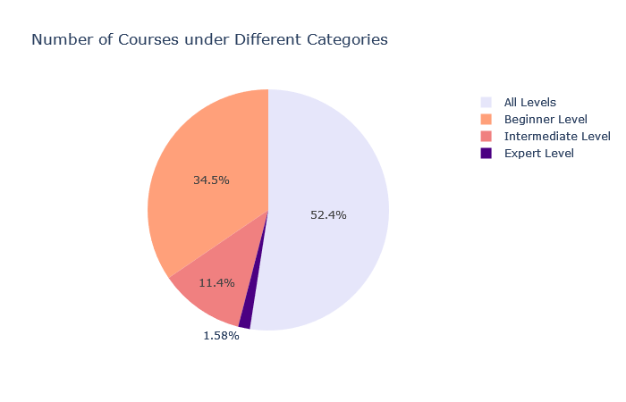
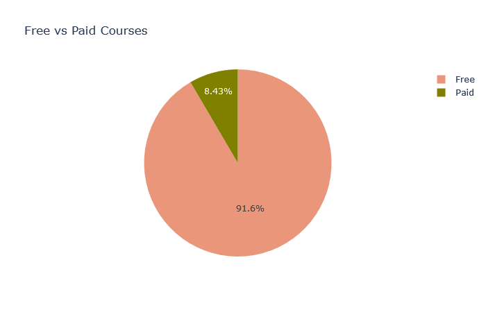
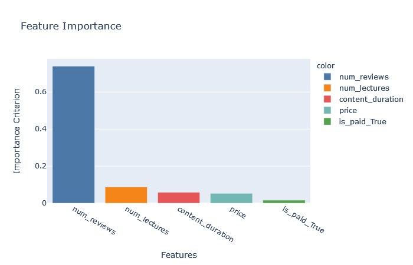

# Data analysis for check The Criteria for take a Courses in Udemy

---


---

## Author: Juan Carlos González
## E-mail: jcgi.laboral@gmail.com

---

## Date: September, 2022

---

---

# Project 
Udemy is one of the largest online learning platforms, hosting thousands of courses across various domains. However, with the vast array of courses, it becomes challenging to assess the quality, demand, and effectiveness of the courses. The platform may face difficulties in:

- Identifying popular and high-quality courses.
- Understanding which factors drive student engagement.
- Predicting future trends and demands in different categories.
- Ensuring that the courses are priced competitively and fairly.
- Thus, conducting an analysis of the Udemy courses helps address these issues, focusing on patterns in course ratings, enrollments, content duration, pricing, and reviews.

# Objectives

The primary objectives of a Udemy Course Analysis could include:

- Identifying Trends and Popularity: Understanding which course topics are trending and what types of courses attract the most enrollments.

- Price vs. Enrollment Analysis: Exploring how the price of a course impacts its enrollment and overall success.

- Quality Assessment: Analyzing student feedback, ratings, and reviews to determine the factors influencing course quality.

- Predictive Analytics: Using machine learning techniques to predict future course enrollments and popularity based on existing data.

- Instructor Insights: Investigating the role of instructors' experience, reputation, and teaching style in course success.

- Category Performance: Examining how different categories (e.g., technology, business, arts) perform in terms of enrollments and ratings.

# Table of Contents

 1. Data Cleaning
 2. Exploratory Data Analysis

    2.1 Subject Categories
    2.2 The Most Famouse Course

    2.2.1 All subjects
    2.2.2 Each subjects

    2.3 The Level of Courses under Each Categories
    2.4 Price of the Courses
    2.5 Free vs Paid Courses

     2.5.1 Number of free vs paid courses
     2.5.2 Different factors in free vs paid courses

    2.6 Time Series
    2.7 Relationships Between Numberical Values
 3. Machine Learning
    3.1 Linear Regression
    3.2 Random Forest


```python
import pandas as pd
import numpy as np
pd.set_option('display.max_columns', None)
import plotly.express as px
from plotly.subplots import make_subplots
import plotly.graph_objects as go


df = pd.read_csv('udemy_courses.csv')
df.head()

```


```python
df.dtypes
```

```bash
course_id               int64
course_title           object
url                    object
is_paid                object
price                  object
num_subscribers         int64
num_reviews             int64
num_lectures            int64
level                  object
content_duration       object
published_timestamp    object
subject                object
dtype: object
```


## Data Cleaning

**'content_duration' is in string, but we will simplify to float, indicating 1.5 hours == 1.5 and 35 mins == 0.35.**


```python


# First we will take care of all hours and hour.
df['content_duration'] = df['content_duration'].str.replace('hours', '').str.replace('hour', '')


# Then we will change minutes into decimals.
df['content_duration'] = df['content_duration'].apply(lambda x: int(x.replace('mins', '').strip()) * 1/100 if 'mins' in x else x)


# There is a one data that mixed data with level and content duration. So we fix it here.
df.loc[df['level'] == '52'] = df.loc[df['level'] == '52'].replace({'52':'Beginner Level', 'Beginner Level': 0.52})

```


**Also, we will change the date type of Price to int, rather than string. "Free" and "TRUE" items will have 0 value.¶**

```python
df['price'] = df['price'].replace('Free', 0).replace('TRUE', 0).astype(int)

```

**We will clean the 'ispaid' column as there are duplicated values such as True/TRUE and False/False. Also we will drop the one with incorrect value.**

```python
df['is_paid'] = df['is_paid'].replace("TRUE", "True").replace("FALSE", "False")
df.drop(df.loc[df['is_paid'] == 'https://www.udemy.com/learnguitartoworship/'].index, inplace=True)

```
**There is a data with wrong content duration or NaN value, so we will drop it as we are not sure what it means.**


```python
df.drop(df.loc[df['content_duration'].str.contains('questions', na=False)].index, inplace=True)
df['content_duration'] = df['content_duration'].astype(float)

```

**Lastly, we will change the time stamps to just date (month/date/year) to simplify.**

```python
df['published_timestamp'] = pd.to_datetime(df['published_timestamp']).dt.strftime('%m/%d/%Y')

```

## EDA
1. Subject Categories

```python
# The number of courses under the categories
course_categories = df['subject'].value_counts().to_frame().reset_index().rename({'subject':'Number of Courses', 
                                                                                  'index':'Categories'}, axis='columns')

fig = px.pie(course_categories, values='Number of Courses', names='Categories', 
             title='Number of Courses under Different Categories', color='Categories',
             color_discrete_map={'Web Development':'darkblue', 'Business Finance':'royalblue', 
                                'Musical Instruments':'cyan', 'Graphic Design':'lightcyan'})
fig.show()

```


**Majority of the courses are either in Web Development and Business Finance. However, we did not see any Business Finance courses in Top 10 the most subscribed course. Learning musicla instruments is quite famouse in Udemy.**

2. The Most Famous Course

We will be using number of suscribers of the courses to measure which ones are the most famous courses in Udemy.

a. All Subjects

```python
# Most subscribed courses
most_sub_courses = df.sort_values(by='num_subscribers', ascending=False)[:10]

fig = px.bar(most_sub_courses, x='course_title', y='num_subscribers', color='course_title', height=600)
fig.update_layout(autosize=True)
fig.show()

```


**So all top 10 courses with the most subscribers are mostly in Web Development except one course in "Free Beginner Electric Guitar Lessons" (obvioulsy, it is free!). Especially HTML5 and CSS3 is hot!**

b Each Subjects

```python


bf_all = df.loc[df['subject'] == 'Business Finance']
bf_top10 = bf_all.sort_values(by='num_subscribers', ascending=False)[:10]
bf_top10 = bf_top10.sort_values(by='num_subscribers')

wd_all = df.loc[df['subject'] == 'Web Development']
wd_top10 = wd_all.sort_values(by='num_subscribers', ascending=False)[:10]
wd_top10 = wd_top10.sort_values(by='num_subscribers')

mi_all = df.loc[df['subject'] == 'Musical Instruments']
mi_top10 = mi_all.sort_values(by='num_subscribers', ascending=False)[:10]
mi_top10 = mi_top10.sort_values(by='num_subscribers')

gd_all = df.loc[df['subject'] == 'Graphic Design']
gd_top10 = gd_all.sort_values(by='num_subscribers', ascending=False)[:10]
gd_top10 = gd_top10.sort_values(by='num_subscribers')


fig = make_subplots(rows=4, cols=1,
                   subplot_titles=("Business Finance", "Web Development", 
                                   "Musical Instruments", "Graphic Designs"))

fig.add_trace(go.Bar(y=bf_top10['course_title'], x=bf_top10['num_subscribers'],
                     orientation='h', name='Business Finance'), row=1, col=1)
fig.add_trace(go.Bar(y=wd_top10['course_title'], x=wd_top10['num_subscribers'],
                     orientation='h', name='Web Development'), row=2, col=1)
fig.add_trace(go.Bar(y=mi_top10['course_title'], x=mi_top10['num_subscribers'],
                     orientation='h', name='Musical Instruments'), row=3, col=1)
fig.add_trace(go.Bar(y=gd_top10['course_title'], x=gd_top10['num_subscribers'],
                     orientation='h', name='Graphic Designs'), row=4, col=1)

fig.update_layout(height=1300, title="Famouse Courses in Each Subject by the Number of Subscribers")

fig.show()

```


3. The level of courses under each categories

**Here we will look at the content level of courses in each categories. There are 4 major levles such as: all levels, bigenner, intermediate and expert level.**

```python


# Level and the number of courses under each level
level_courses = df['level'].value_counts().reset_index().rename(columns={'index':'Levels', 'level':'Number of Courses'})

fig = px.pie(level_courses, values='Number of Courses', names='Levels',
             title='Number of Courses under Different Categories', color='Levels',
             color_discrete_map={'All Levels':'lavender', 'Beginner Level':'lightsalmon', 
                                'Intermediate Level':'lightcoral', 'Expert Level':'indigo'})
fig.show()

```


**All level courses are more than half. And also lots of beginner level courses. Less than 2% is expert level courses. Now we will look at the levels of courses under the different categories.**

```python
# Dataframes for each subject categories
bf = df.groupby(['subject', 'level']).count()['course_id']['Business Finance'].to_frame().reset_index().rename(columns={'level':'Level', 
                                                                                       'course_id':'Number of Courses'})
wd = df.groupby(['subject', 'level']).count()['course_id']['Web Development'].to_frame().reset_index().rename(columns={'level':'Level', 
                                                                                       'course_id':'Number of Courses'})
mi = df.groupby(['subject', 'level']).count()['course_id']['Musical Instruments'].to_frame().reset_index().rename(columns={'level':'Level', 
                                                                                       'course_id':'Number of Courses'})
gd = df.groupby(['subject', 'level']).count()['course_id']['Graphic Design'].to_frame().reset_index().rename(columns={'level':'Level', 'course_id':'Number of Courses'})


# Levles and the number of courses under each categories

fig = make_subplots(rows=2, cols=2, specs=[[{"type": "pie"}, {"type": "pie"}],
                                           [{"type": "pie"}, {"type": "pie"}]], 
                    subplot_titles=("Business Finance","Wep Development", "Musical Instruments", "Graphic Design"))

colors = ['gold', 'mediumturquoise', 'darkorange', 'lightgreen']

fig.add_trace(go.Pie(values=bf['Number of Courses'], labels=bf['Level']),
              row=1, col=1)

fig.add_trace(go.Pie(values=wd['Number of Courses'], labels=wd['Level']),
              row=1, col=2)

fig.add_trace(go.Pie(values=mi['Number of Courses'], labels=mi['Level']),
              row=2, col=1)

fig.add_trace(go.Pie(values=gd['Number of Courses'], labels=gd['Level']),
              row=2, col=2)

fig.update_layout(height=900, showlegend=True,  title_text="The number of Courses with Different Levels Under Each Categories")
fig.update_traces(hoverinfo='label+percent', textinfo='label', textfont_size=13,
                  marker=dict(colors=colors, line=dict(color='#000000', width=2)))

fig.show()

```


**Most of the subjects has the most courses in all and beginner level. Especially for graphic design courses, almost 90% of its courses are for beginner or all levels. The courses in musical instruments has the most courses in intermediate level.**

4. Price of the Courses


```python
# Mean price and subject categories
mean_price_category = df.groupby('subject')['price'].mean().to_frame().reset_index()

fig = px.bar(mean_price_category, x='subject', y='price', color='subject', text='price', 
             height=500, color_discrete_sequence=px.colors.sequential.Plasma_r)
fig.update_layout(autosize=True, title="Mean Price of Each Subjects", 
                  yaxis_title="Mean Price", xaxis_title="Subjects")
fig.update_traces(textposition='outside')
fig.update_yaxes(range=[0, 100])
fig.show()

```


**Web Development has the highest mean price, and Musical Instruments has the cheapest.**

5. Free vs Paid Courses

Here we will be comparing two types of courses, free and paid. We will try to find out if paid materials has the higher number of letures and longer hours, or if free materials has the higher number of subscribers and reviews.

a. Number of Free vs Paid courses


```python
free_count = df['is_paid'].value_counts().to_frame().reset_index().rename(columns={'index':'Is Free?', 'is_paid':'Count'})
free_count.replace({'True':'Free', 'False':'Paid'}, inplace=True)

fig = px.pie(free_count, values='Count', names='Is Free?', title='Free vs Paid Courses', color='Count',
            color_discrete_sequence=['darksalmon', 'olive'])

fig.show()
```




b. Different factors in free vs paid courses¶


```python


free_v_paid = df.groupby('is_paid')[['content_duration', 
                       'num_lectures', 
                       'num_subscribers', 
                       'num_reviews']].sum().reset_index().replace({'False': 'Free', 'True':'Paid'})


fig = make_subplots(rows=2, cols=2, specs=[[{"type": "bar"}, {"type": "bar"}], [{"type": "bar"}, {"type": "bar"}]],
                   subplot_titles=("Content Duration", "Number of Lectures", "Number of Subscribers", "Number of Reviews"))

fig.add_trace(go.Bar(x=free_v_paid['is_paid'], y=free_v_paid['content_duration'],
                    marker=dict(color=free_v_paid['content_duration'])),
              row=1, col=1)

fig.add_trace(go.Bar(x=free_v_paid['is_paid'], y=free_v_paid['num_lectures'],
                    marker=dict(color=free_v_paid['num_lectures'])),
              row=1, col=2)

fig.add_trace(go.Bar(x=free_v_paid['is_paid'], y=free_v_paid['num_subscribers'],
                    marker=dict(color=free_v_paid['num_subscribers'])),
              row=2, col=1)

fig.add_trace(go.Bar(x=free_v_paid['is_paid'], y=free_v_paid['num_reviews'],
                    marker=dict(color=free_v_paid['num_reviews'])),
              row=2, col=2)

fig.update_layout(showlegend=False, height=700, title_text="Free vs Paid Couses")

fig.show()

```


**As you can see from here, Paid courses has higher numbers of lectures, subscribers and reveiws than Free courses.**

6. Time Series

We will look at the date publisehd for each course subjects, this visualization was originally generated by user Sayar_Banner in Kaggle.


```python
subjects = df['subject'].unique()
subset = df[['published_timestamp','subject']]
subset = subset.sort_values('published_timestamp')
time_series = subset['published_timestamp'].value_counts().reset_index()
time_series.columns = ['Date', 'Counts']
time_series = time_series.sort_values('Date')
time_series['Cum Count'] = time_series['Counts'].cumsum()
dummies = pd.get_dummies(subset['subject'])
subset = subset.join(dummies)

subset['Cum Business'] = subset['Business Finance'].cumsum()
subset['Cum Software'] = subset['Web Development'].cumsum()
subset['Cum Music'] = subset['Musical Instruments'].cumsum()
subset['Cum Design'] = subset['Graphic Design'].cumsum()
subset_melt = subset.melt(id_vars='date_published', value_vars=['Cum Business', 'Cum Software', 'Cum Design', 'Cum Music'])


fig = make_subplots(rows=2, cols=1, subplot_titles=("Time series plot of number of courses",
                                                    "Time series plot of number of courses by subject"))
df.sort_values('published_timestamp', inplace=True)

fig.append_trace(go.Scatter(x=time_series['Date'], y=time_series['Cum Count'], name="All",
                            mode='lines'), row=1, col=1)

fig.append_trace(go.Scatter(x=subset['published_timestamp'], y=subset['Cum Business'], mode="lines",
                            name="Business", line=dict(color="#617C58")), row=2, col=1)
fig.append_trace(go.Scatter(x=subset['published_timestamp'], y=subset['Cum Software'], mode="lines",
                            name="Software", line=dict(color="#74597D", dash="longdashdot")),
                 row=2, col=1)

fig.append_trace(go.Scatter(x=subset['published_timestamp'], y=subset['Cum Design'], mode="lines",
                            name="Design", line=dict(color="#C85A17", dash="dash")),
                 row=2, col=1)

fig.append_trace(go.Scatter(x=subset['published_timestamp'], y=subset['Cum Music'], mode="lines",
                            name="Music", line=dict(color="#1884C7", dash="dashdot")),
                 row=2, col=1)

fig.update_layout(width=900, height=800)
fig.show()

```


7. Relationships between numerical values

**We will look at some scatter plots for numerical values and if there is any relationships**


```python
fig = make_subplots(rows=2, cols=2,
                   subplot_titles=("Number of Subscrb. and Number of Reviews", 
                                   "Number of Subscrb. and Price", 
                                   "Number of Lectures and Price",
                                   "Content Duration and Price"))

fig.add_trace(go.Scatter(x=df['num_subscribers'], y=df['num_reviews'], mode='markers'), row=1, col=1)
fig.add_trace(go.Scatter(x=df['num_subscribers'], y=df['price'], mode='markers'), row=1, col=2)
fig.add_trace(go.Scatter(x=df['num_lectures'], y=df['price'], mode='markers'), row=2, col=1)
fig.add_trace(go.Scatter(x=df['content_duration'], y=df['price'], mode='markers'), row=2, col=2)

fig.update_xaxes(title_text="Number of Subscribers", row=1, col=1)
fig.update_xaxes(title_text="Number of Subscribers", row=1, col=2)
fig.update_xaxes(title_text="Number of Lectures", row=2, col=1)
fig.update_xaxes(title_text="Content Duration", row=2, col=2)

fig.update_yaxes(title_text="Number of Reviews", row=1, col=1)
fig.update_yaxes(title_text="Price", row=1, col=2)
fig.update_yaxes(title_text="Price", row=2, col=1)
fig.update_yaxes(title_text="Price", row=2, col=2)

fig.update_layout(height=800, width=900, showlegend=False)
fig.show()

```


**We can see that there are no speical relationships except the first plot, number of subscribers and number of reviews. It seems apparent that if the course has high number of subscribers, it will most likely high number of reviews. Other than that, it seems no relationships between other variables.**

## Machine Learning

We will try to predict the price based on the number of subscribers, and other factors

a. Linear Regression (number of subscribers and price)

```python
from sklearn.linear_model import LinearRegression
df_linear = df[['course_id', 'course_title', 'price']]


skl_reg = LinearRegression().fit(df[['num_subscribers']].values, df['price'].values)
skl_reg.score(df[['num_subscribers']].values, df['price'].values)

```

```bash
0.0025775267802027324

```

```python
df_linear['pred_price'] = skl_reg.predict(df[['price']].values)

df_linear.head()

```

```bash
 	course_id 	course_title 	price 	pred_price
1966 	347104 	Learn to Play the Oboe: Beginner to Pro in Und... 	50 	65.023883
2205 	344348 	Master the Clarinet: Intermediate Instruction ... 	50 	65.023883
2206 	373556 	Advanced Clarinet Studies - Learn to Master th... 	50 	65.023883
2285 	349142 	Master Oboe Playing: Intermediate Instruction ... 	50 	65.023883
1844 	338926 	Learn to Play Clarinet: Beginner to Pro in Und... 	50 	65.023883
```


b. Predicting subscriber count (https://www.kaggle.com/sayar1106/comprehensive-eda-predicting-subscriber-count/notebook)

```python
from sklearn.ensemble import RandomForestRegressor
from sklearn.model_selection import train_test_split
from sklearn.metrics import mean_squared_error
from sklearn.preprocessing import StandardScaler

num_cols = ['price', 'num_reviews', 'num_lectures', 'content_duration']
cat_cols = ['is_paid', 'level', 'subject']
X_data, y_data = df[num_cols].merge(pd.get_dummies(df[cat_cols]), left_index=True, right_index=True), df['num_subscribers']


X_train, X_test, y_train, y_test = train_test_split(X_data, y_data, test_size=0.2, random_state=42)
col_names = X_train.columns


# Applying Standard Scaler
scaler = StandardScaler()
scaler = scaler.fit(X_train) 
X_train = scaler.transform(X_train)
X_test = scaler.transform(X_test)


rf_model = RandomForestRegressor(n_estimators=500, random_state=42)


rf_model.fit(X_train, y_train)

```

```bash
RandomForestRegressor(bootstrap=True, criterion='mse', max_depth=None,
                      max_features='auto', max_leaf_nodes=None,
                      min_impurity_decrease=0.0, min_impurity_split=None,
                      min_samples_leaf=1, min_samples_split=2,
                      min_weight_fraction_leaf=0.0, n_estimators=500,
                      n_jobs=None, oob_score=False, random_state=42, verbose=0,
                      warm_start=False)
```

```python
y_train_preds = rf_model.predict(X_train)

print("Mean Squared Error on training data is: {:.2f}".format(mean_squared_error(y_train_preds, y_train)))

```

```bash
Mean Squared Error on training data is: 5978532.78
```

```python
y_pred = rf_model.predict(X_test)

print("Mean Squared Error on testing data is: {:.2f}".format(mean_squared_error(y_pred, y_test)))

```

```bash
Mean Squared Error on testing data is: 23191721.85
```

```python
# Feature Importance
imp_features = pd.Series(rf_model.feature_importances_, index=col_names).nlargest(5)
px.bar(x=imp_features.index, y=imp_features.values,
       labels={'x':"Features", 'y':"Importance Criterion"},
       color=imp_features.index,
       color_discrete_sequence=px.colors.qualitative.T10,
       title="Feature Importance")

```




